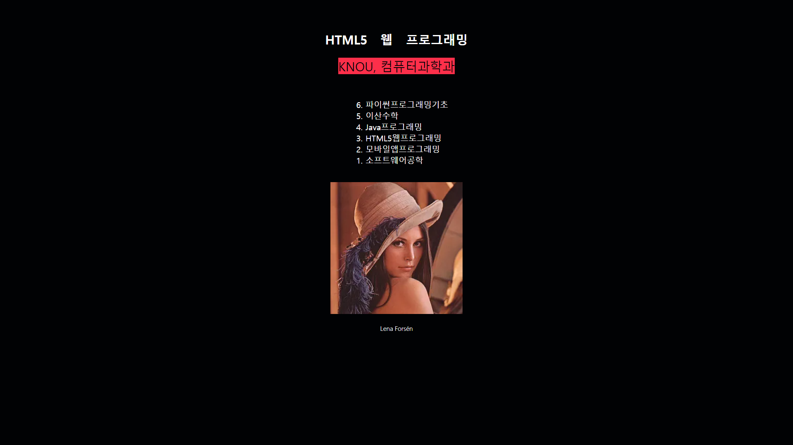
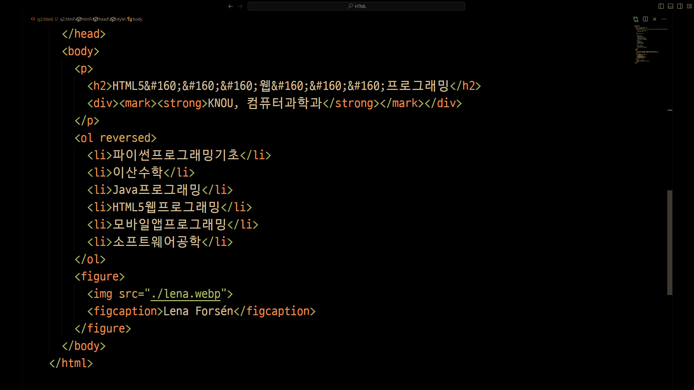
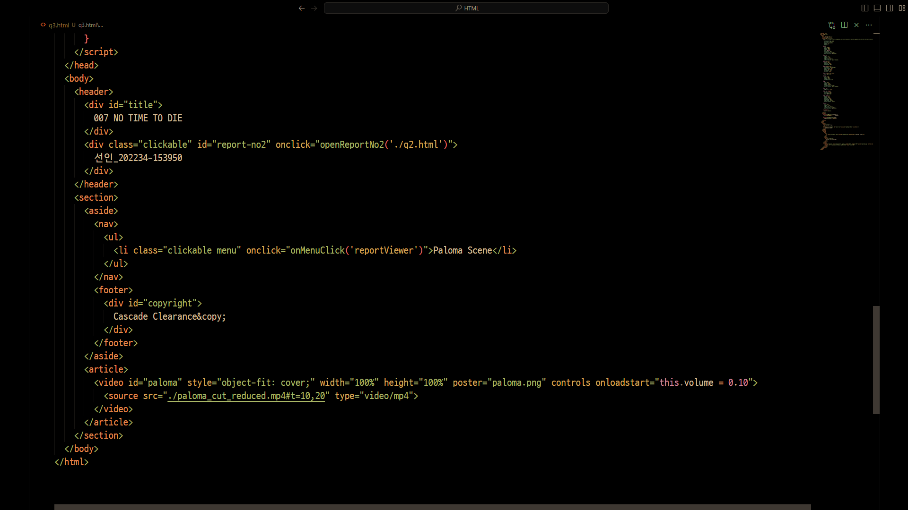

## 출석수업 과제물(평가결과물) 표지(온라인제출용)
### 교과목명 : HTML5 웹 프로그래밍
### 학 번 : 202234-153950
### 성 명 : 선 인
### 강 의 실 : 서울지역대학 ZOOM3, ZOOM4, ZOOM5 호
### 연 락 처 : 010-4849-4471
---
## Project Webpage
```https://seliis.github.io/knou-grd2-sem1-html/```

## GitHub Repository
```https://github.com/seliis/knou-grd2-sem1-html.git```

## Question 1

### 1-1. 요소인지 속성인지 표현하고 사용 용도를 설명
- iframe : (요소), In-Line Frame, 현재 Document 에 다른 Document 를 렌더링
- colgroup : (요소), 테이블의 각 Field 를 Span Attribute 로 Grouping
- preload : link 요소의 (속성)으로 렌더링 엔진이 개입하기 전에 리소스 Load
- details : (요소), Expand 가능한 Widget 으로 Summary 요소로 Title 지정 가능
- link : (요소), CSS, JS, Favicon 등 외부 리소스 연결

### 1-2. 블록 요소와 인라인 요소
```html
<!-- 블록 요소 : 블록으로 Line 을 열고 닫음. 다음은 div 와 p 는 블록 요소임. -->
<div>
    <p>Lorem Ipsum</p>
</div>
<!-- 인라인 요소 : Line 에 포함되어 구성됨. 다음 중 span 이 인라인 요소임. -->
<div>
    <p>Brown Fox Jumps Over <span style="color: red;">Lazy Dog</span></p>
</div>
```
---
## Question 2
### 2-1. View

### 2-2. SourceCode


---
## Question 3
### 3-1. View

### 3-2. SourceCode
